# Weaver - Open Source


## About


- What was your motivation?
- Why did you build this project?
- What problem does it solve?

The full documentation of Weaver is hosted on Wiki.

## Table of Contents


- [Weaver - Open Source](#weaver---open-source)
  - [About](#about)
  - [Table of Contents](#table-of-contents)
  - [Dependencies](#dependencies)
  - [Install](#install)
    - [Linux](#linux)
    - [Windows](#windows)
    - [Windows Subsystem for Linux (WSL)](#windows-subsystem-for-linux-wsl)
  - [Build](#build)
  - [Usage](#usage)
  - [Credits](#credits)
  - [License](#license)

## Dependencies

In order to make use of Weaver, the following dependencies are required:

- The project is implemented in **C++17**, which requires the following compilers:
  - **GCC** v11.2.0+
  - **G++** v11.2.0+
- The following dependencies are required to install the C++ libraries:
  - **Vcpkg** v2023.04.15+
- The following dependencies are required to build the project:
  - **Make** v4.3+
  - **CMake** v3.25.1+
- The following C++ libraries are required to build the project:
  - **magic-enum** v0.8.1+
  - **cxxopts** v3.0.0+
  - **nlohmann\-json** v3.11.2+
  - **fmt** v9.0.0+

<details><summary><h3>Additional dependencies</h3></summary>

<h4>Linux</h4>

- The following dependencies are required to install **Vcpkg**:
  - **curl** v7.81.0+
  - **zip** v3.0+
  - **unzip** v6.0+
  - **tar** v1.34+
  - **pkg-config** v0.29.2+
  - **git** v2.34.1+

<h4>Windows</h4>

- The following dependencies are required to install package manager:
  - **MSYS2** v2023.05.26+
- The following dependencies are required to install **Vcpkg**:
  - **git\-lfs** v3.3.0+

</details>

## Install

> **Warning**  
> This section require administrator privileges.

> **Warning**  
> If you are using the standalone version, you do not need to install anything. Except for the WSL version, where you will need to install WSL (from step 1 to step 6).

### Linux

To perform a Weaver installation, you must complete the following steps:

1. Double-Click on **`openTerminal.out`**.

    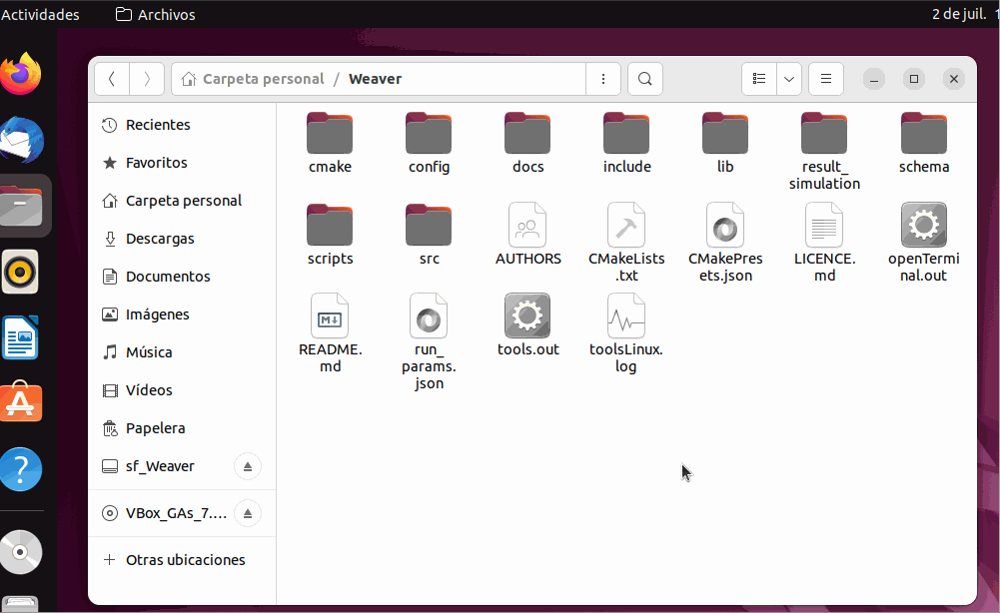

2. Run **`tools.out`**.

    

3. Selection of project version for installation.

    

4. Enter your superuser password.

    > **Warning**  
    > For security reasons, the password entry is not visible on the terminal.

    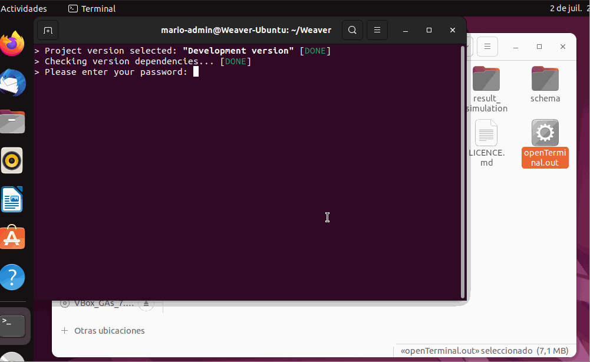

5. Accepts or rejects the installation of the version dependency.

    

6. Installation of dependencies.

    > **Warning**  
    > This may take several minutes.

7. Exit the programme.

    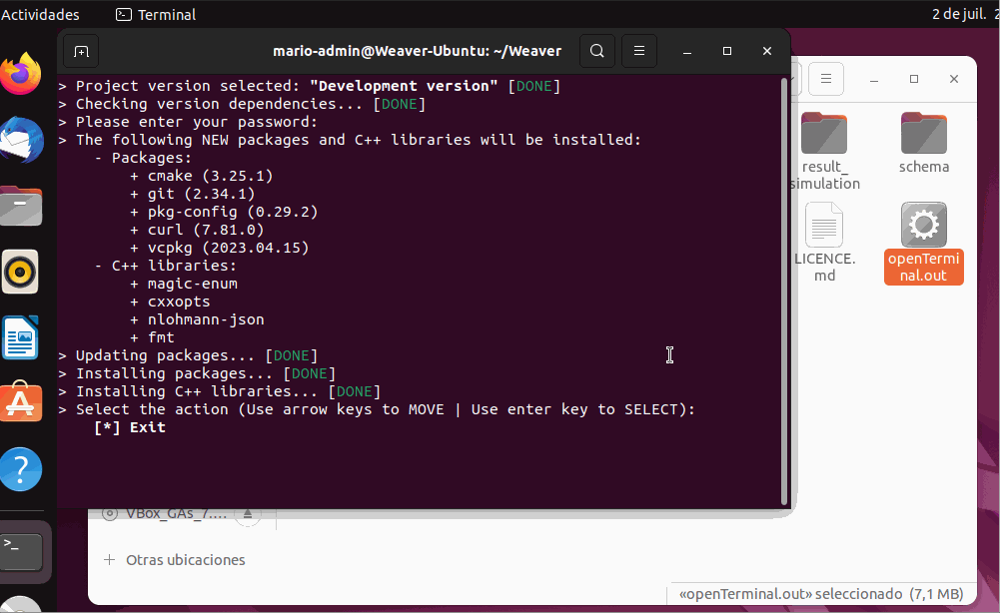

### Windows

To perform a Weaver installation, follow the steps below:

1. Run `tools.exe` as administrator.

    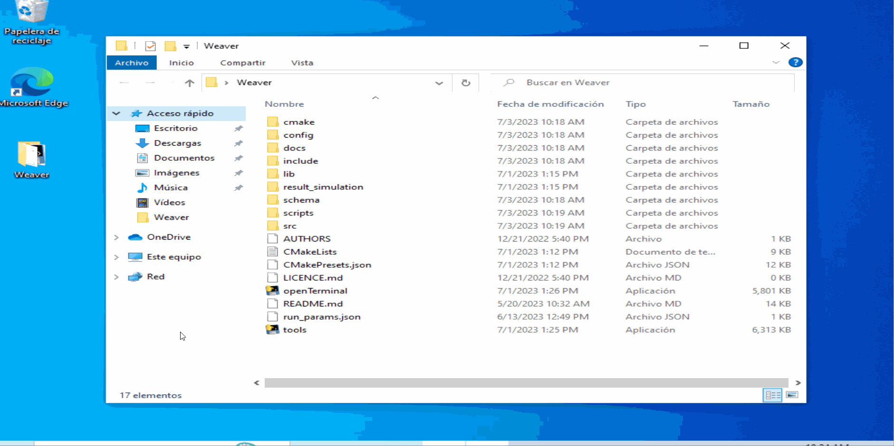

2. Selection of project version for installation.

    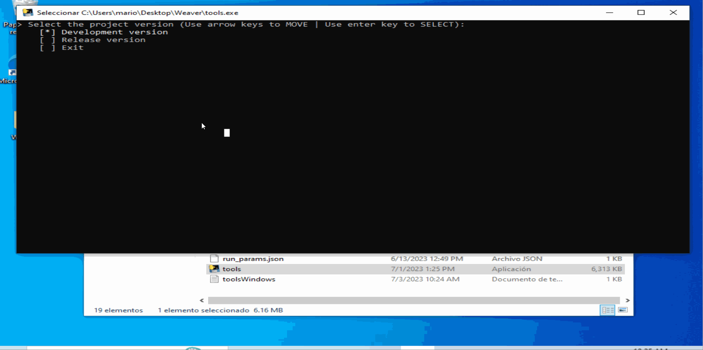

3. Accepts or rejects the installation of the version dependency.

    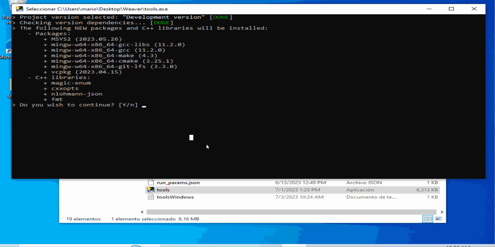

4. Installation of dependencies.

    > **Warning**  
    > This may take several minutes.

5. Exit the programme.

    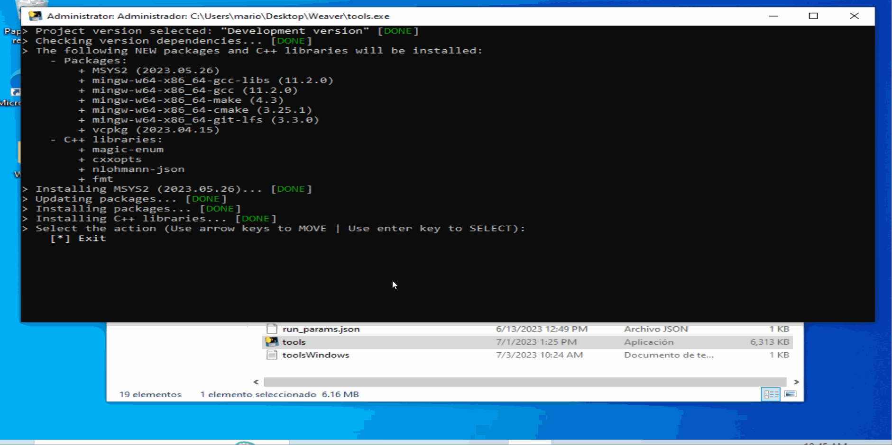

### Windows Subsystem for Linux (WSL)

To perform a Weaver installation, you must complete the following steps:

1. Run `installWSL.exe` as administrator.

    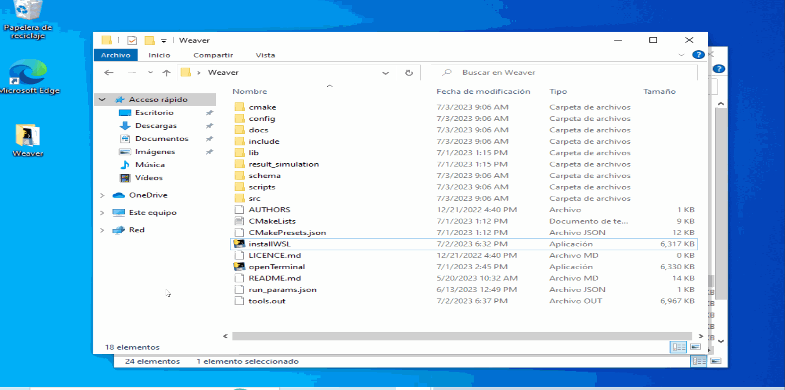

2. (Optional) Reboot system

    > **Note**  
    > A restart is required when certain Windows features are enabled.

    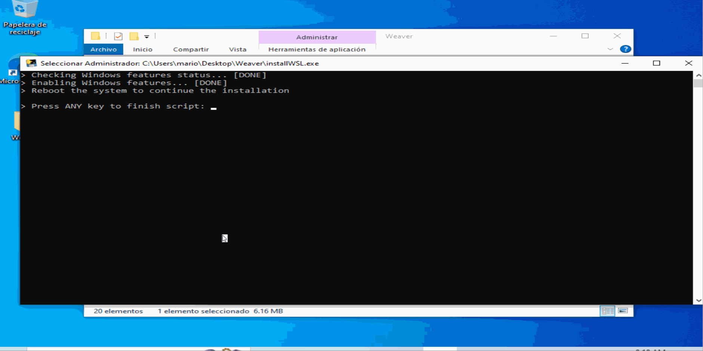

3. Run `installWSL.exe` as administrator again.

    

4. Installation of WSL.

    > **Warning**  
    > This may take several minutes.

5. Enter your superuser password.

    > **Warning**  
    > For security reasons, the password entry is not visible on the terminal.

    > **Warning**  
    > The password need not be the same as Windows.

    

6. Exit the programme.

    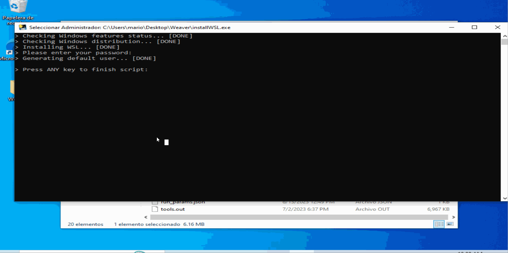

7. Double-Click on **`openTerminal.exe`**.

    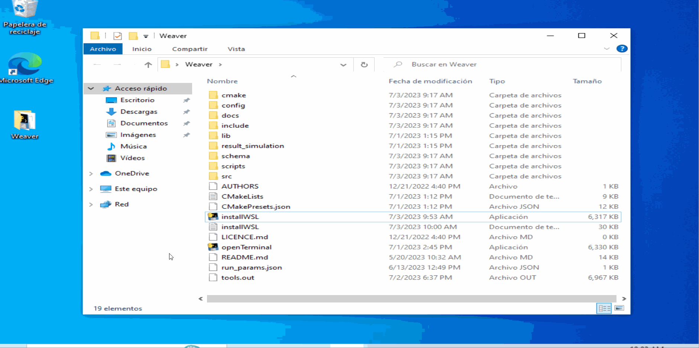

8. Runs from step 2 to the last step of [Linux installation](#linux).

## Build

Cmake is used to automate the Weaver build process. Due to the use of Cmake, the build is cross-platform.

To define the different build types for the project, a [`CMakePresets.json`](./CMakePresets.json) file has been created, where the characteristics of the different types are defined.

To start the construction process, you must complete the following steps:

1. Double-Click on **`openTerminal.out`** or **`openTerminal.exe`**.


2. Execute Weaver construction.

```
cmake --workflow --preset <preset-name>
```

Where `preset-name` is the name under which the preset workflow has been defined in the `workflowPresets` section of the file [`CMakePresets.json`](./CMakePresets.json).

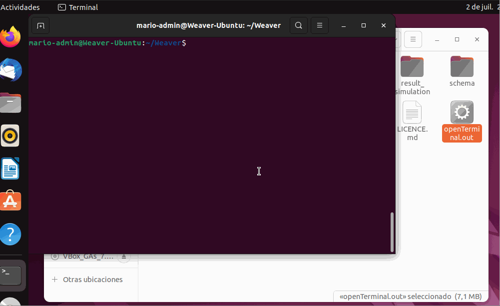

If you do not know which `workflowPresets` are available, you can run the following command:

> **Note**  
> This command displays the name of the `workflowPresets` along with a description of the `workflowPresets`.

```
cmake --list-presets
```

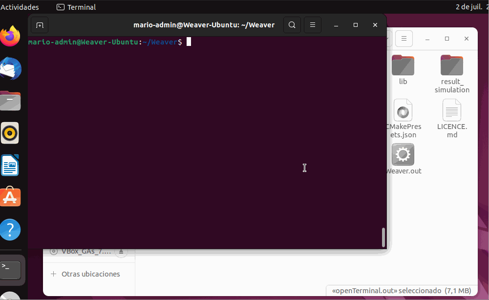

## Usage

The [`run_params.json`](./run_params.json) file is used to define the inputs and outputs of the programme. This file contains the following main parameters:

- The inputs are defined by two parameters:

  - `configFolder`: Directory containing the input configuration folder
  - `configName`: Input configuration folder name

- The outputs are defined by two parameters:

  - `resultFolder`: Directory containing the results folder
  - `resultName`: Results folder name

Depending on the value of the command line parameters used to run the program, the location of the run_params.json file may vary.

If Weaver is run with the default parameters, the file must be at the same path level as the Weaver program.


<h3>Linux</h3>

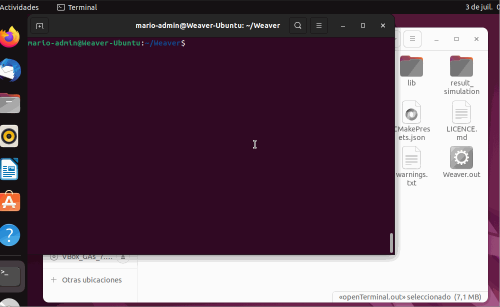

<h3>Windows</h3>

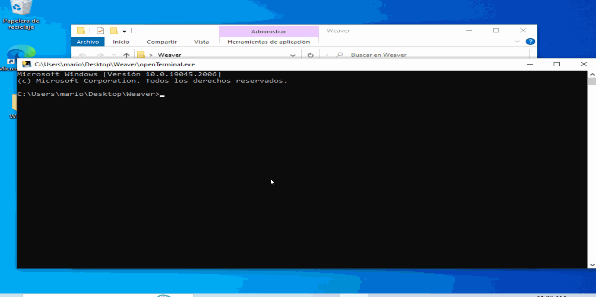

Or

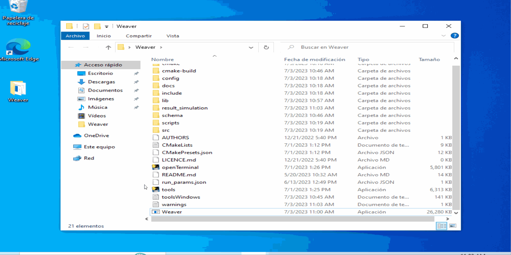

When Weaver is run by passing a value to one of the command line parameters, the file must be located at the path level specified by the command line parameters.

The command line parameters are as follows:

- `-I`, `--inputFolder`: Directory containing the `run_params.json` file. 
  - Default value: Directory containing the Weaver program
- `-i`, `--inputFile`: Filename `run_params.json`
  - Default value: `run_params.json`
- `-o`, `--outputFolder`: Directory containing the results folder
  - Default value: `result_simulation`

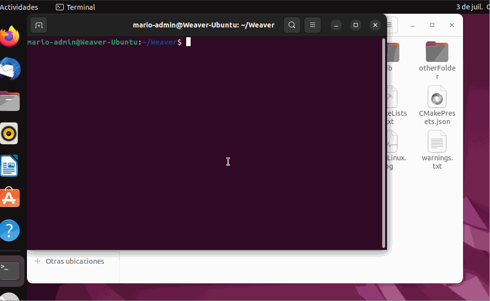

## Credits


## License


